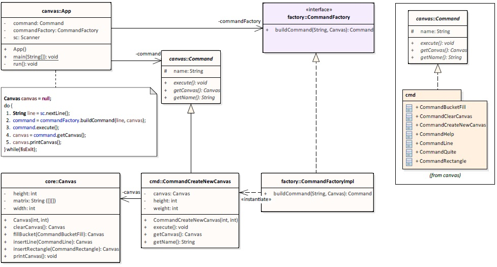

This is the a simple project I had to complete for an interview.

# The Challenge
You're given the task of writing a simple console version of a drawing program. In a nutshell, the program should work as follows:
1. create a new canvas
2. start drawing on the canvas by issuing various commands
3. quit

At the moment, the program should support the following commands:
- __C w h__ Should create a new canvas of width w and height h.
- __L x1 y1 x2 y2__ Should create a new line from _(x1,y1)_ to _(x2,y2)_. Currently only horizontal or vertical lines are - supported. Horizontal and vertical lines will be drawn using the 'x' character.
- __R x1 y1 x2 y2__ Should create a new rectangle, whose upper left corner is _(x1,y1)_ and lower right corner is _(x2,y2)_. Horizontal and vertical lines will be drawn using the 'x' character.
- __B x y c__ Should fill the entire area connected to (x,y) with "colour" c. The behaviour of this is the same as that of the "bucket fill" tool in paint programs.
- __Q__ Should quit the program.

Below is a sample run of the program. User input is prefixed with `enter command:`.
```
enter command: C 20 4
----------------------
|                    |
|                    |
|                    |
|                    |
----------------------

enter command: L 1 2 6 2
----------------------
|                    |
|xxxxxx              |
|                    |
|                    |
----------------------

enter command: L 6 3 6 4
----------------------
|                    |
|xxxxxx              |
|     x              |
|     x              |
----------------------

enter command: R 16 1 20 3
----------------------
|               xxxxx|
|xxxxxx         x   x|
|     x         xxxxx|
|     x              |
----------------------

enter command: B 10 3 o
----------------------
|oooooooooooooooxxxxx|
|xxxxxxooooooooox   x|
|     xoooooooooxxxxx|
|     xoooooooooooooo|
----------------------
```

# Solution

### Project Structure
For the implementation of the drawing program we need the following components:
- A parser for parsing the input typed by the user into commands and for this we use `CommandFactory`.
- A new `Command` class for each command we want to add to the drawing program.
- A class which define the state of the program and for this we use `Canvas`.

If we try to model the implementation using the command pattern described by _GoF_ we have: 
- `App.java` as _invoker_.
- package `cmd` contains all _concrete commands_.
- `Canvas.java` the _receiver_ which defines what to do on each command receiver. 

Example of _"create new canvas"_ implementation:



If we try to read the UML the sequence of instruction is :
1. User types in the console `C 10 5` (ex)
2. The concrete command `CommandCreateNewCanvas` is created. `Canvas` passed as parameter can be `null`.
3. `CommandCreateNewCanvas.execute()` creates `new Canvas(widht, heigh)`;
4. Get the updated state of the object `Canvas`.
5. Print the new state.


The project is composed by the following packages:
- `com.ea.examples.canvas`  Entry point of the application.
- `com.ea.examples.canvas.cmd` All commands supported by the application.
- `com.ea.examples.canvas.core` Core of the application, `Canvas.java` in this case.
- `com.ea.examples.exception` All _checked exceptions_ thrown by the application.

---
###	Bucket filler "algorithm"
The approach used for filling the area, in `CommandBucketFill`, is as follows:
1. Call the method which fill only one pixel (if free)
2. Call recursively same method for the 4 adjacent pixels: x+1, y; x, y+1; x-1, y; x, y-1.
3. Method exits when finds borders or already a filled pixel.
		
__Complexity of the algorithm__  <br/>
The complexity of the algorithm is _NumberOfFreePixels_ x 4.<br/>
If we have an empty _Canvas[20x5]_ the filler will make 400 calls, so 400 access to the _matrix[][]_.<br/>
Number of updates to the _matrix[][]_ is equal to the number of pixels to be colored.
	
###	Tests

Choosed `TDD approach` for Canvas implementation. This means the TestCases had been created before or during the development phase and not in the end.
 
For each functionality is present a different test file:
- `CommandBucketFillTest.java` Test cases for BucketFiller command.
- `CommandLineTest.java` Test cases for drawing a line command.
- `CommandRectangleTest.java` Test cases for drawing a rectangle command.
- `UseCaseTest.java` Test cases covering bugs discovered in ta second moment.

Unit tests are divided in three categories:
-  `Happy Paths` _testHP_nomeTest_ wich are the tests that has to succeed. Usually we assert at the end of the method what we are expecting
- `Case Limit` _testCL_nomeTest_ wich are the tests that test a Limit Case. Example, x, y are 0 ore same as width/height. Usually we assert what we are expecting or pay attention of eventual exceptions
- `Exceptions` _testEX_nomeTest_ wich are the tests that test exception cases. In this cases we define the exception we are waiting to be thrown.

In case of new enhancements or different implementation for the Canvas.java the unit tests will act as Integration Tests. 
Before committing new changes to repository everything must be "green" :) 

###	A Working build

A working build is present in the path ./dist:
- canvas.jar -> application packaged as a jar file.
- canvas.bat -> easy and fast way to test the application.


###	Timeline

Total time spend for the release 13 hours subdivided as follows:
	9 Hours development + Unit tests  (3 days from 3 hours each)
	2 Hours testing User Interface canvas.jar  / Bug fixing
	2 Hours documentation